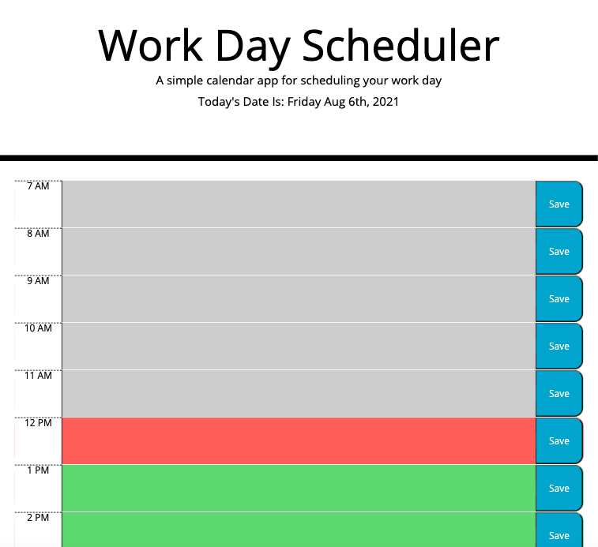

# Work-Planner-hw

## Description

The web application was created for a user to be able to use and a daily planner with hourly blocks to write in notes/scheduled items. The planner has the current date and the hour sections are color coded to represent the current hour (red), upcoming hours (green) and past hours are greyed out, to help users visually as the day goes on. The data is stored in local storage so the user can exit out of the application and re-open it later with out losing their notes/schedule. The main problem the pallner solves is to provide the user with a basic simple way to keep track of events throughout their day. I learned how to take pre-existing code and make it interactive for users. I also finally figured out how to use local storage and store variables where users can access them later. Additionally, using momnet made displaying time and dates so easy and will be a great tool to use in the future.

### Browser requirements

A browswer is all that is required to use this application.

#### Image

##### Language:

Used jQuery, Bootstrap, HTML, Javascript and moment.js to create this webapplication.

Jquery: https://jquery.com/download/
Bootstrap: https://getbootstrap.com/
Moment.js: https://momentjs.com/

### Deployed Link

https://adrianauch.github.io/Work-Planner-hw/

#### License

Copyright 2021

Permission is hereby granted, free of charge, to any person obtaining a copy of this software and associated documentation files (the "Software"), to deal in the Software without restriction, including without limitation the rights to use, copy, modify, merge, publish, distribute, sublicense, and/or sell copies of the Software, and to permit persons to whom the Software is furnished to do so, subject to the following conditions:

The above copyright notice and this permission notice shall be included in all copies or substantial portions of the Software.

THE SOFTWARE IS PROVIDED "AS IS", WITHOUT WARRANTY OF ANY KIND, EXPRESS OR IMPLIED, INCLUDING BUT NOT LIMITED TO THE WARRANTIES OF MERCHANTABILITY, FITNESS FOR A PARTICULAR PURPOSE AND NONINFRINGEMENT. IN NO EVENT SHALL THE AUTHORS OR COPYRIGHT HOLDERS BE LIABLE FOR ANY CLAIM, DAMAGES OR OTHER LIABILITY, WHETHER IN AN ACTION OF CONTRACT, TORT OR OTHERWISE, ARISING FROM, OUT OF OR IN CONNECTION WITH THE SOFTWARE OR THE USE OR OTHER DEALINGS IN THE SOFTWARE.

##### Contact

Adrian Auchterlonie
email: adrian.acuh11@gmail.com
